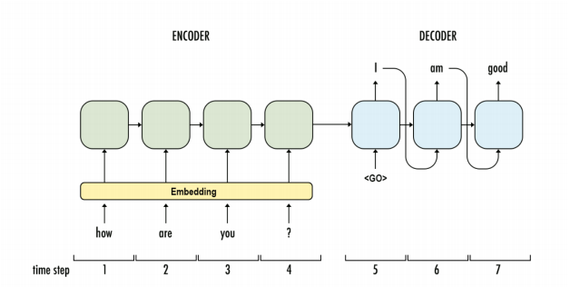

    
    <h1>Udacity Deep Learning Nanodegree</h1>
    
Become an expert in neural networks, and learn to implement them using the deep learning framework PyTorch. Build convolutional networks for image recognition, recurrent networks for sequence generation, generative adversarial networks for image generation, and learn how to deploy models accessible from a website. - <a href="https://www.udacity.com/course/deep-learning-nanodegree--nd101">Source</a>

    
The Deep Learning Nanodegree program is divided into five parts, giving a understanding of deep learning, and covering some of the major topics.

     

 

<!--Part First-->
<h2>Introduction</h2>

The first part is an introduction to the program as well as a couple lessons covering
tools. Here I also got a chance to apply some deep learning models to do
cool things like transferring the style of artwork to another image.

Here I started with a simple introduction to linear regression and machine learning. That
gave me the vocabulary I need to understand the advancements, and made
clear where deep learning fits into the broader picture of machine learning techniques.

 

 
<!--Part Second-->

<h2>Neural Networks</h2>

In this part, I learnt how to build a simple neural network from scratch using
python. I covered the algorithms used to train networks such as gradient descent and
backpropagation.

The <b>first project</b> (<a href="https://github.com/ravingalaxy/ML-Deep-Learning/tree/master/Projects/Project_1-Predicting_Bike_Sharing_Patterns">PREDICTING BIKE-SHARING PATTERNS</a>) is also created in this part. In this project, I predicted bike ridership
using a simple neural network.

 

 
<small>Multi-layer neural network with some inputs and a single output. Image from <a href="https://cs231n.github.io/convolutional-networks/">Stanford's cs231n course.</a>
</small>

<h3>Sentiment Analysis</h3>

I also learnt about model evaluation and validation, an important technique for
training and assessing neural networks. And I got a chance to learn Sentiment Analysis from a guest instructor Andrew Trask,
author of <a href="https://www.manning.com/books/grokking-deep-learning">Grokking Deep Learning</a>, developing a neural network for processing text and predicting sentiment. The exercises in each chapter of his book are also available in
his <a href="https://github.com/iamtrask/Grokking-Deep-Learning">Github repository</a>.

<h3>Deep Learning with PyTorch</h3>

The last lesson in this part is all about using the deep learning framework, PyTorch. Here,
I learnt how to use the Tensor datatype, and the foundational knowledge I
need to define and train my own deep learning models in PyTorch!

 

 

 

     
    
<!--Part Third-->

<h2>Convolutional Networks</h2> 
    

Convolutional networks have achieved state of the art results in computer vision. These
types of networks can detect and identify objects in images. Here I learnt how to build
convolutional networks in PyTorch.

Here I also created the <b>second project</b> (<a href="#">DOG-BREED CLASSIFIER</a>), where i built a convolutional network to classify dog breeds in pictures.

 

 
<small>Structure of a convolutional neural network.</small>

I also used convolutional networks to build an <i>autoencoder</i>, a network architecture
used for image compression and denoising. Then, I use a pre-trained neural
network, to classify images the network has never seen before, a technique known
as <i>transfer learning</i>.

 

     
    
<!--Part Forth-->

<h2>Recurrent Neural Networks</h2> 

In this part, I learnt about <b>Recurrent Neural Networks (RNNs)</b> — a type of network
architecture particularly well suited to data that forms sequences like text, music, and
time series data. I built a recurrent neural network that can generate new text
character by character.

 

 
<small>Examples of input/output sequence types.</small>

<h3>Natural Language Processing</h3>

Then, I learnt about word embeddings and implement the <a href="https://en.wikipedia.org/wiki/Word2vec">Word2Vec</a> model, a network that can learn about semantic relationships between words. These are used to increase the efficiency of networks when I am processing text.

I combined embeddings and an RNN to predict the sentiment of movie reviews, an
example of common tasks in natural language processing.

In the <b>third project</b> (<a href="#">GENERATE TV SCRIPTS</a>), I used what I had learnt here to generate new TV scripts
from provided, existing scripts.

 

 
<small>An example RNN structure in which an encoder represents the question: "how are you?" and a
decoder generates the answer: "I am good".</small>

 

 

<!--Part Fifth-->

<h2>Generative Adversarial Networks</h2>

Generative adversarial networks (GANs) are one of the newest and most exciting deep learning architectures, showing incredible capacity for understanding real-world data.

In this part, I learnt about and implement GANs for a variety of tasks. You'll even see how to code a <a href="https://github.com/junyanz/CycleGAN">CycleGAN</a> for generating images, and learnt from one of the creators of this formulation, Jun-Yan Zhu, a researcher at <a href="https://www.csail.mit.edu/">MIT's CSAIL</a>.

 

 
<small>Examples of image-to-image translation done by <a href="https://github.com/junyanz/pytorch-CycleGAN-and-pix2pix">CycleGAN and Pix2Pix</a> formulations.</small>

 

The inventor of GANs, Ian Goodfellow, will show me how GANs work and how to
implement them. Then, in the <b>fourth project</b> (<a href="#">GENERATE FACES</a>), I used a deep convolutional GAN to
generate completely new images of human faces.

 

 
<small>Low-res, GAN-generated images of faces.</small>

 

 

<!-- Part Six -->
<h2>Deploying Machine Learning Models</h2>

As more and more companies look to build AI products, there is a growing demand for
engineers who are able to deploy machine learning models to global audiences. In this
part, I got experience deploying a model so that it can be accessed via a web app
and respond to user input.

 

 
<small>Image of a cloud service connecting data to a laptop.</small>

 

You'lI also learnt to monitor a model using PyTorch and <a href="https://aws.amazon.com/sagemaker/">Amazon's SageMaker</a>. In the <b>fifth project</b> (<a href="#">DEPLOYING A SENTIMENT ANALYSIS MODEL</a>), I deployed my own PyTorch sentiment analysis model and create a gateway for accessing this model from a website.

 

 

<!--Projects list-->

<h2>Projects I Have Built</h2>

The five projects I have completed in this course are perhaps the most important part of my learning journey. They gave me the chance to apply what i had learnt and even share my work with friends or potential employers! These projects are designed to be challenging and interesting. I got feedback from a real person; a Udacity reviewer. This reviewer helped me figure out what could be improved in my code and i submited my code again until I pass the project.

Here are the five projects, created by me:

 
1. <a href="https://github.com/ravingalaxy/ML-Deep-Learning/tree/master/Projects/Project_1-Predicting_Bike_Sharing_Patterns">PREDICTING BIKE-SHARING PATTERNS</a>
 
2. <a href="#">DOG-BREED CLASSIFIER</a>
 
3. <a href="#">GENERATE TV SCRIPTS</a>
 
4. <a href="#">GENERATE FACES</a>
 
5. <a href="#">DEPLOYING A SENTIMENT ANALYSIS MODEL</a>
 
